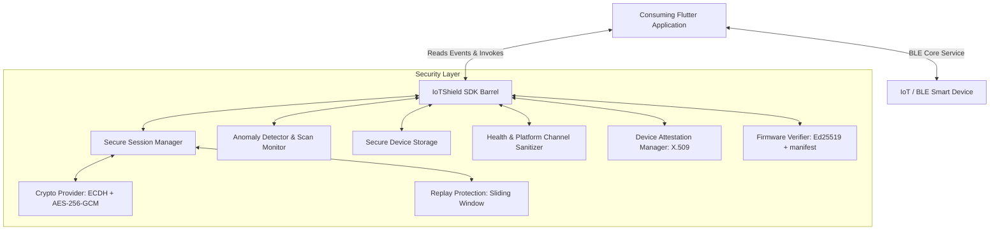

# <h1 align="center">🛡️ Flutter IoT Shield 🛡️</h1>

<p align="center">
  <a href="https://pub.dev/packages/flutter_iot_shield"></a>
  <a href="https://github.com/Syf-Almjd/flutter_iot_shield"></a>
  <a href="https://github.com/Syf-Almjd/flutter_iot_shield"></a>
  <a href="https://github.com/Syf-Almjd/flutter_iot_shield"></a>
  <a href="https://opensource.org/licenses/MIT"></a>
  <a href="https://pub.dev/packages/flutter_iot_shield"></a>
</p>

An enterprise-grade, lightweight security layer for Flutter applications communicating with BLE (Bluetooth Low Energy) smart devices. This package integrates multiple cybersecurity practices to secure sensitive local user data and communication channels.

## Features

#### 🔐 ECDH Key Exchange & Symmetric Encryption (AES-256-GCM)
#### 📜 X.509 Device Identity Attestation
#### 🛡️ Anti-Replay Sliding Window Protection
#### ⚙️ Secure Firmware Verification & Rollback Prevention
#### ⚡ Real-Time Anomaly & Scan Rate Monitoring
#### 🔒 Cryptographically Secure Key Store
#### 📊 Telemetry & Health Data Sanitization

##
# 📖 Getting Started

To use this package, add `flutter_iot_shield` as a dependency in your `pubspec.yaml` file:

```yaml
dependencies:
  flutter_iot_shield: ^1.2.1
```

Then import the necessary features in your Dart code:

```dart
import 'package:flutter_iot_shield/flutter_iot_shield.dart';
```

##
# 📐 Architecture Overview



##
# Features & Code Examples
##

## 🔐 Initialization

Initialize the [IoTShield](file:///Users/saifalmajd/saif/flutter_iot_shield/lib/src/core/iot_shield.dart) singleton once in your application initialization sequence (e.g., inside `main.dart`):

```dart
import 'package:flutter/material.dart';
import 'package:flutter_iot_shield/flutter_iot_shield.dart';

void main() async {
  WidgetsFlutterBinding.ensureInitialized();

  // Configure your credentials and settings
  final config = IoTShieldConfig(
    appId: 'com.yourcompany.smartwatch',
    verboseLogging: true,
    // Ed25519 public key used to verify firmware OTA updates
    firmwarePublicKey: '-----BEGIN PUBLIC KEY-----\n...\n-----END PUBLIC KEY-----',
  );

  await IoTShield.instance.initialize(config);

  runApp(const MyApp());
}
```

##

## 🔑 Device Trust Assessment

Assess the risk level of an advertising BLE device before pairing:

```dart
import 'package:flutter_iot_shield/flutter_iot_shield.dart';

final trustLevel = await IoTShield.instance.verifyDevice(
  deviceId: '00:11:22:33:AA:BB',
  deviceInfo: {
    'model': 'WatchPro_X1',
    'firmwareVersion': '1.2.0',
    'bleVersion': '5.2',
  },
);

if (trustLevel == TrustLevel.suspicious) {
  // Take action: disconnect or warn the user
  print('Security warning: Connected device has been flagged as suspicious.');
}
```

##

## 🧑✋ ECDH Secure Channel & X.509 Attestation

Derive shared session keys and verify the cryptographic signature challenge using the device certificate:

```dart
import 'dart:typed_data';
import 'package:flutter_iot_shield/flutter_iot_shield.dart';

try {
  final session = await IoTShield.instance.pairDevice(
    '00:11:22:33:AA:BB',
    'WatchPro_X1',
    devicePublicKey: devicePublicKeyBytes,      // Raw public key bytes from device
    deviceCertificateDer: deviceCertDerBytes,    // X509 certificate DER bytes
    challengeResponse: challengeSignatureBytes,  // Device's signature over challenge
    challengeNonce: sentNonceBytes,             // Original nonce sent to device
  );
  
  print('Secure session established. Session ID: ${session.sessionId}');
} on AttestationException catch (e) {
  print('Device identity verification failed: $e');
}
```

##

## 🔒 Symmetric Encryption & Decryption (AES-256-GCM)

Encrypt command payloads using AES-256-GCM and protect them against replay attacks:

```dart
import 'dart:typed_data';
import 'package:flutter_iot_shield/flutter_iot_shield.dart';

// 1. Encrypt outgoing command payload
final SecurePacket packet = await IoTShield.instance.encrypt(
  Uint8List.fromList([0x01, 0x02, 0x03]), // plaintext command bytes
  '00:11:22:33:AA:BB',
  command: 0x0A,
  sequence: 42, // strictly increasing sequence
);

// Transmit packet.encryptedPayload, packet.nonce (IV), and packet.mac over your BLE characteristic...

// 2. Decrypt incoming data packet from the device
try {
  final Uint8List plaintext = await IoTShield.instance.decrypt(
    packet, // parsed SecurePacket containing ciphertext, iv, and mac
    '00:11:22:33:AA:BB',
  );
  print('Decrypted bytes: $plaintext');
} on ReplayAttackException catch (e) {
  print('Security threat: Replay attack detected! $e');
}
```

##

## ⚡ Real-Time Anomaly & Scan Rate Monitoring

The [AnomalyDetector](file:///Users/saifalmajd/saif/flutter_iot_shield/lib/src/monitoring/anomaly_detector.dart) monitors connection trends to emit alerts for reconnection storms, device switching, or high scanning activity:

```dart
import 'package:flutter_iot_shield/flutter_iot_shield.dart';

// Access the detector
final detector = IoTShield.instance.anomalyDetector;

// Record connection events
detector.recordConnect('00:11:22:33:AA:BB');
detector.recordDisconnect('00:11:22:33:AA:BB');

// Record scan events to track scanning frequency
detector.recordScanEvent();
```

To capture and act on security events globally, subscribe to the global stream:

```dart
IoTShield.instance.securityEvents.listen((SecurityEvent event) {
  if (event.severity == SecuritySeverity.critical) {
    print('🚨 CRITICAL SECURITY EVENT: ${event.message}');
    print('Metadata: ${event.metadata}');
  }
});
```

##

## ⚙️ Secure Firmware Verification

Ensure OTA firmware updates are authentic by checking digital signatures and enforcing anti-rollback version checks:

```dart
import 'dart:typed_data';
import 'package:flutter_iot_shield/flutter_iot_shield.dart';

final metadata = FirmwareMetadata(
  currentVersion: '1.1.0',
  hardwareId: 'WatchPro_X1',
);

final result = await IoTShield.instance.verifyFirmware(
  firmwareZipBytes,
  metadata,
);

if (result is FirmwareVerified) {
  print('✓ Firmware image verification passed. Version: ${result.version}');
} else if (result is FirmwareRejected) {
  print('❌ Firmware verification rejected: ${result.reason}');
}
```

##
## Release Notes

### Version 1.0.0
- Initial release of the Flutter IoT Shield library, supporting enterprise-grade end-to-end security layers for BLE communications.
- Complete support for ECDH Curve25519 session keys, AES-256-GCM encryption, X509 certificate parsing, anti-rollback firmware checks, sliding-window anti-replay, and real-time event alerts.

For more details and information about the package usage, refer to the [GitHub repository](https://github.com/Syf-Almjd/flutter_iot_shield).

If you encounter issues or have improvement suggestions, [open an issue](https://github.com/Syf-Almjd/flutter_iot_shield/issues) on GitHub.


## 🌻 License

This project is open-source software licensed under the [MIT License](LICENSE.md).

---


<h4 align="center">Support Open Source Development</h4>

<div align="center">

[](https://github.com/sponsors/Syf-Almjd)

</div>
<p align="center">
  Created with 💙 by <a href="https://github.com/Syf-Almjd">SaifAlmajd</a>
</p>

