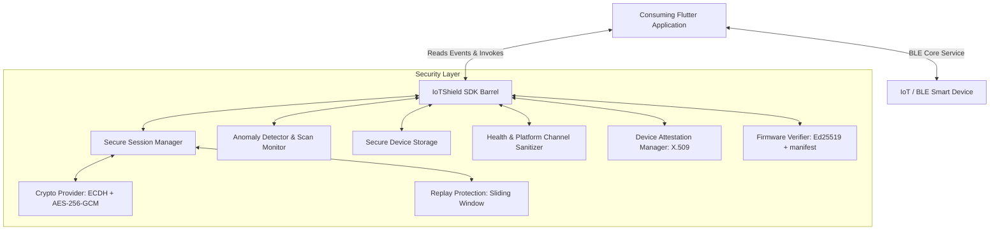

# <h1 align="center">🛡️ Flutter IoT Shield 🛡️</h1>

<p align="center">
  <a href="https://pub.dev/packages/flutter_iot_shield"></a>
  <a href="https://github.com/Syf-Almjd/flutter_iot_shield"></a>
  <a href="https://github.com/Syf-Almjd/flutter_iot_shield"></a>
  <a href="https://github.com/Syf-Almjd/flutter_iot_shield"></a>
  <a href="https://github.com/Syf-Almjd/flutter_iot_shield"></a>
  <a href="https://opensource.org/licenses/MIT"></a>
  <a href="https://pub.dev/packages/flutter_iot_shield"></a>
</p>

An enterprise-grade, lightweight security layer for Flutter applications communicating with BLE (Bluetooth Low Energy) smart devices. This package integrates multiple cybersecurity practices to secure sensitive local user data and communication channels.

## Features

#### 🔐 ECDH Key Exchange & Symmetric Encryption (AES-256-GCM)
#### 📜 X.509 Device Identity Attestation
#### 🛡️ Anti-Replay Sliding Window Protection
#### ⚙️ Secure Firmware Verification & Rollback Prevention
#### ⚡ Real-Time Anomaly & Scan Rate Monitoring
#### 🔒 Cryptographically Secure Key Store
#### 📊 Telemetry & Health Data Sanitization

##
# 📖 Getting Started

To use this package, add `flutter_iot_shield` as a dependency in your `pubspec.yaml` file:

```yaml
dependencies:
  flutter_iot_shield: ^1.0.0
```

Then import the necessary features in your Dart code:

```dart
import 'package:flutter_iot_shield/flutter_iot_shield.dart';
```

##
# 📐 Architecture Overview



##
# Features & Code Examples
##

## 🔐 Initialization

Initialize the [IoTShield](file:///Users/saifalmajd/saif/flutter_iot_shield/lib/src/core/iot_shield.dart) singleton once in your application initialization sequence (e.g., inside `main.dart`):

```dart
import 'package:flutter/material.dart';
import 'package:flutter_iot_shield/flutter_iot_shield.dart';

void main() async {
  WidgetsFlutterBinding.ensureInitialized();

  // Configure your credentials and settings
  final config = IoTShieldConfig(
    appId: 'com.yourcompany.smartwatch',
    verboseLogging: true,
    // Ed25519 public key used to verify firmware OTA updates
    firmwarePublicKey: '-----BEGIN PUBLIC KEY-----\n...\n-----END PUBLIC KEY-----',
  );

  await IoTShield.instance.initialize(config);

  runApp(const MyApp());
}
```

##

## 🔑 Device Trust Assessment

Assess the risk level of an advertising BLE device before pairing:

```dart
import 'package:flutter_iot_shield/flutter_iot_shield.dart';

final trustLevel = await IoTShield.instance.verifyDevice(
  deviceId: '00:11:22:33:AA:BB',
  deviceInfo: {
    'model': 'WatchPro_X1',
    'firmwareVersion': '1.2.0',
    'bleVersion': '5.2',
  },
);

if (trustLevel == TrustLevel.suspicious) {
  // Take action: disconnect or warn the user
  print('Security warning: Connected device has been flagged as suspicious.');
}
```

##

## 🧑✋ ECDH Secure Channel & X.509 Attestation

Derive shared session keys and verify the cryptographic signature challenge using the device certificate:

```dart
import 'dart:typed_data';
import 'package:flutter_iot_shield/flutter_iot_shield.dart';

try {
  final session = await IoTShield.instance.pairDevice(
    '00:11:22:33:AA:BB',
    'WatchPro_X1',
    devicePublicKey: devicePublicKeyBytes,      // Raw public key bytes from device
    deviceCertificateDer: deviceCertDerBytes,    // X509 certificate DER bytes
    challengeResponse: challengeSignatureBytes,  // Device's signature over challenge
    challengeNonce: sentNonceBytes,             // Original nonce sent to device
  );
  
  print('Secure session established. Session ID: ${session.sessionId}');
} on AttestationException catch (e) {
  print('Device identity verification failed: $e');
}
```

##

## 🔒 Symmetric Encryption & Decryption (AES-256-GCM)

Encrypt command payloads using AES-256-GCM and protect them against replay attacks:

```dart
import 'dart:typed_data';
import 'package:flutter_iot_shield/flutter_iot_shield.dart';

// 1. Encrypt outgoing command payload
final SecurePacket packet = await IoTShield.instance.encrypt(
  Uint8List.fromList([0x01, 0x02, 0x03]), // plaintext command bytes
  '00:11:22:33:AA:BB',
  command: 0x0A,
  sequence: 42, // strictly increasing sequence
);

// Transmit packet.encryptedPayload, packet.nonce (IV), and packet.mac over your BLE characteristic...

// 2. Decrypt incoming data packet from the device
try {
  final Uint8List plaintext = await IoTShield.instance.decrypt(
    packet, // parsed SecurePacket containing ciphertext, iv, and mac
    '00:11:22:33:AA:BB',
  );
  print('Decrypted bytes: $plaintext');
} on ReplayAttackException catch (e) {
  print('Security threat: Replay attack detected! $e');
}
```

##

## ⚡ Real-Time Anomaly & Scan Rate Monitoring

The [AnomalyDetector](file:///Users/saifalmajd/saif/flutter_iot_shield/lib/src/monitoring/anomaly_detector.dart) monitors connection trends to emit alerts for reconnection storms, device switching, or high scanning activity:

```dart
import 'package:flutter_iot_shield/flutter_iot_shield.dart';

// Access the detector
final detector = IoTShield.instance.anomalyDetector;

// Record connection events
detector.recordConnect('00:11:22:33:AA:BB');
detector.recordDisconnect('00:11:22:33:AA:BB');

// Record scan events to track scanning frequency
detector.recordScanEvent();
```

To capture and act on security events globally, subscribe to the global stream:

```dart
IoTShield.instance.securityEvents.listen((SecurityEvent event) {
  if (event.severity == SecuritySeverity.critical) {
    print('🚨 CRITICAL SECURITY EVENT: ${event.message}');
    print('Metadata: ${event.metadata}');
  }
});
```

##

## ⚙️ Secure Firmware Verification

Ensure OTA firmware updates are authentic by checking digital signatures and enforcing anti-rollback version checks:

```dart
import 'dart:typed_data';
import 'package:flutter_iot_shield/flutter_iot_shield.dart';

final metadata = FirmwareMetadata(
  currentVersion: '1.1.0',
  hardwareId: 'WatchPro_X1',
);

final result = await IoTShield.instance.verifyFirmware(
  firmwareZipBytes,
  metadata,
);

if (result is FirmwareVerified) {
  print('✓ Firmware image verification passed. Version: ${result.version}');
} else if (result is FirmwareRejected) {
  print('❌ Firmware verification rejected: ${result.reason}');
}
```

##
## Release Notes

### Version 1.0.0
- Initial release of the Flutter IoT Shield library, supporting enterprise-grade end-to-end security layers for BLE communications.
- Complete support for ECDH Curve25519 session keys, AES-256-GCM encryption, X509 certificate parsing, anti-rollback firmware checks, sliding-window anti-replay, and real-time event alerts.

For more details and information about the package usage, refer to the [GitHub repository](https://github.com/Syf-Almjd/flutter_iot_shield).

If you encounter issues or have improvement suggestions, [open an issue](https://github.com/Syf-Almjd/flutter_iot_shield/issues) on GitHub.

##

<h2 align="center">💙 Support IoT Security Development 💙</h2>

<div align="center">

[](https://www.buymeacoffee.com/saifalmajdalmassri)
[](https://ko-fi.com/saifalmajdalmassri)

</div>

##

# <h2 align="center">👨💻 Framework Developer Profile 👨💻</h2>
<h1 align="center">Hi 👋, I'm Saif Almajd</h1>
<p align="center">  </p>
<h3 align="center">Passionate of Full Stack Mobile/Web Development</h3>
<p align="center"> 
  <a href="https://instagram.com/saif_almajd" target="blank"></a> 
  <a href="https://github.com/Syf-Almjd" target="blank"></a> 
  <a href="https://www.linkedin.com/in/saif-almajd/" target="blank"></a> 
  <a href="https://twitter.com/hsaifalmajd" target="blank"></a>
  <a href="https://pub.dev/publishers/saifalmajd.blogspot.com/packages" target="blank"></a>
</p>

<p align="center"> 
  
  
</p>

<h3 align="center">Favourite Languages and Tools:</h3>
<p align="center"> 
  <a href="https://developer.android.com" target="_blank" rel="noreferrer">  </a> 
  <a href="https://dart.dev" target="_blank" rel="noreferrer">  </a> 
  <a href="https://www.figma.com/" target="_blank" rel="noreferrer">  </a> 
  <a href="https://firebase.google.com/" target="_blank" rel="noreferrer">  </a> 
  <a href="https://flutter.dev" target="_blank" rel="noreferrer">   </a> 
</p>

- 🔭 I’m currently working on [Flutter IoT Shield](https://github.com/Syf-Almjd/flutter_iot_shield)

- 🌱 I’m currently learning **Springboot, Dart Servers**

- 👨💻 All of my projects are available at [SaifAlmajd.web.app/](https://saifalmajd.web.app/)

- 💬 Ask me about **Flutter, Java, Data Structure & Algorithms**

- 📫 How to reach me **syfalmjd11@gmail.com**

- ⚡ Fun fact **I am an AspireX Leadership Alumni :)**

<h1></h1>

I proudly embrace my roles as a Developer, Leader, and Believer in our shared journey toward a better humanity 🌎.

👨🏻💻 As a committed computer science professional and visionary leader, my mission is to harness the potential of technology to uplift humanity and leave a positive imprint on our world. In my capacity as the Manager of MJD Foundation, my focus is unwavering – I endeavor to craft ingenious tools that enhance and simplify the lives of everyone.

## 🔧 Expertise

- 💼 **Mobile Development**: Passionately expanding my expertise in mobile development to create user-friendly and innovative solutions.

- 🔒 **Cybersecurity**: Committed to ensuring the safety and security of digital landscapes in an increasingly connected world.
- 🚀 **Project Management and Leadership**: Proficiently orchestrating projects from inception to completion, optimizing resources, and leading cross-functional teams to deliver successful outcomes.

## 🌱 Continuous Learning

My unwavering belief in the power of continuous learning drives me to stay at the forefront of the latest advancements in the field.

## 💪 Versatility

With a background as a seasoned software engineer, I possess the versatility to navigate diverse platforms and excel in both written and verbal communication. My precision-oriented approach enables me to demystify intricate software challenges into easily digestible concepts.

## 🤝 Collaboration

I am actively seeking collaborative opportunities in the domains of Flutter, Dart, Cybersecurity, and Mobile Development. If you share my enthusiasm for creating groundbreaking solutions, please don't hesitate to reach out to me at [syfalmjd11@gmail.com](mailto:syfalmjd11@gmail.com).

Let's join forces and shape technology into a more human-centric and empowering force for our global community! 🌎

<h3 align="center">Connect with Me:</h3>
<p align="center">
  <a href="https://twitter.com/hsaifalmajd" target="blank"></a>
  <a href="https://linkedin.com/in/saif-almajd" target="blank"></a>
  <a href="https://stackoverflow.com/users/19370215" target="blank"></a>
  <a href="https://instagram.com/saif_almajd/" target="blank"></a>
  <a href="https://dribbble.com/saifalmajd" target="blank"></a>
  <a href="https://hashnode.com/@saifalmajd" target="blank"></a>
  <a href="https://auth.geeksforgeeks.org/user/syfalm4h6f" target="blank"></a>
  <a href="/https://github.com/syf-almjd.atom" target="blank"></a>
</p>

<h3 align="center">Support:</h3>
<p align="center"> 
  <a href="https://www.buymeacoffee.com/saifalmajdalmassri"> </a>
  <a href="https://ko-fi.com/saifalmajdalmassri"> &nbsp; </a>
</p>
<br><br>
